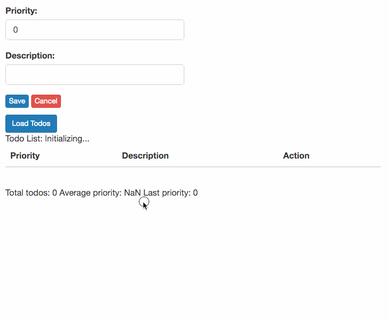

# Multiple Listeners

_Note: this is Part 3 of "Composing Features and Behaviours in the Elm Architecture". See the
[Introduction](https://github.com/foxdonut/adventures-reactive-web-dev/tree/master/client-elm#composing-features-and-behaviours-in-the-elm-architecture)
for an overview and the table of contents._

Having created two features and connected them together, let's now add a third feature and see what
we can have multiple listeners for the same event.

We'll add a `TodoSummary` feature that displays the total number of todos, the average priority, and
the priority of the last todo to have been added or edited.

The file structure remains the same as what we have been using so far:

```
TodoSummary/
  Action.elm
  Feature.elm
  Model.elm
  Update.elm
  View.elm
```

The only difference is that we have no `Service.elm` file. The `TodoSummary` feature does not
communicate with the server nor does it emit any events, so no services are required.

There isn't much to this feature, so let's just look at the primary parts:

[TodoSummary/Update.elm](TodoSummary/Update.elm)
```elm
update : Action -> Model -> ( Model, Effects Action )
update action model =
  case action of
    Update todos ->
      ( { model | todos = todos }, Effects.none )

    LastSaved maybeTodo ->
      ( { model | lastSaved = maybeTodo }, Effects.none )
```

[TodoSummary/View.elm](TodoSummary/View.elm)
```elm
totalPriority : List Todo -> Int
totalPriority todos =
  List.map .priority todos |> List.sum


view : Signal.Address Action -> Model -> Html
view address model =
  let
    totalTodos =
      List.length model.todos

    averagePriority =
      toFloat (totalPriority model.todos) / toFloat totalTodos
  in
    div
      [ class "row" ]
      [ div
      -- ...
                  [ text
                      ("Total todos: "
                        ++ toString totalTodos
                        ++ " Average priority: "
                        ++ toString averagePriority
                        ++ " Last priority: "
                        ++ toString (model.lastSaved |> Maybe.map .priority |> Maybe.withDefault 0)
                      )
                  ]
      ]
```

[TodoSummary/Feature.elm](TodoSummary/Feature.elm)
```elm
type alias Config =
  { inputs : List (Signal Action)
  }


type alias TodoSummaryFeature =
  App Model


createTodoSummaryFeature : Config -> TodoSummaryFeature
createTodoSummaryFeature config =
  start
    { init = ( { todos = [], lastSaved = Nothing }, Effects.none )
    , update = update
    , view = view
    , inputs = config.inputs
    }
```

The feature itself is quite simple. The point here is not the feature itself, but rather to see how
we wire in an additional feature in `TodoMain`. First, we create a mailbox for the feature:

[TodoMain.elm](TodoMain.elm)
```elm
todoSummaryMailbox : Signal.Mailbox TodoSummary.Action.Action
todoSummaryMailbox =
  Signal.mailbox (Update [])
```

Next, we create the feature and pass in the mailbox's signal to the inputs:

[TodoMain.elm](TodoMain.elm)
```elm
todoSummaryFeature : App TodoSummary.Model.Model
todoSummaryFeature =
  createTodoSummaryFeature { inputs = [ todoSummaryMailbox.signal ] }
```

We are ready to wire in the `TodoSummary`'s mailbox address into the outputs of `TodoList` and
`TodoForm` so that it can be notified when the todo list has been updated, and when a todo has been
saved:

[TodoMain.elm](TodoMain.elm)
```elm
todoListFeature : App TodoList.Model.Model
todoListFeature =
  createTodoListFeature
    { inputs = [ todoListMailbox.signal ]
    , outputs =
        { onEditTodo = [ Signal.forwardTo todoFormMailbox.address Edit ]
        , onUpdatedList = [ Signal.forwardTo todoSummaryMailbox.address Update ] --<<----
        }
    }


todoFormFeature : App TodoForm.Model.Model
todoFormFeature =
  createTodoFormFeature
    { inputs = [ todoFormMailbox.signal ]
    , outputs =
        { onSaveTodo =
            [ Signal.forwardTo todoListMailbox.address UpdateList
            , Signal.forwardTo todoSummaryMailbox.address LastSaved --<<----
            ]
        }
    }
```

We have accomplished two things here: we have a feature (`TodoSummary`) that listens to events from
multiple features (`TodoList` and `TodoForm`), and we have multiple listeners on a feature's output
(`TodoForm`'s `onSaveTodo` notifies both `TodoList` and `TodoSummary`.)

What's left is to combine the view from `TodoSummary` into our main view:

[TodoMain.elm](TodoMain.elm)
```elm
todoMainView : Html -> Html -> Html -> Html
todoMainView todoListView todoFormView todoSummaryView =
  div
    []
    [ todoFormView
    , todoListView
    , todoSummaryView
    ]


html : Signal Html
html =
  Signal.map3 todoMainView todoListFeature.html todoFormFeature.html todoSummaryFeature.html
```

The code for returning the `html` and the `tasks`, as well as the code in `Main.elm`, does not need
to change.



We have seen how we can have multiple listeners on a feature, and have a feature listen to multiple
features. In
[Part 4](https://github.com/foxdonut/adventures-reactive-web-dev/tree/elm-040-todominmax-feature/client-elm#composing-features)
we look at combining small features into one large feature.

