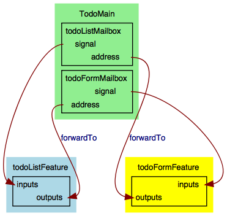
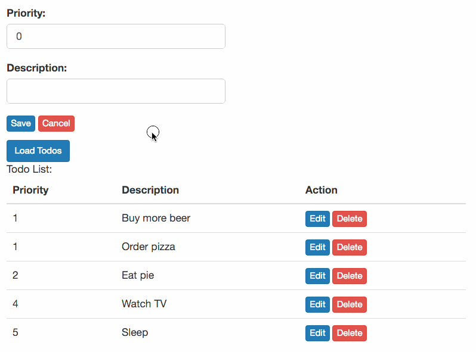

# Connecting Features Together

_Note: this is Part 2 of "Composing Features and Behaviours in the Elm Architecture". See the
[Introduction](https://github.com/foxdonut/adventures-reactive-web-dev/tree/master/client-elm#composing-features-and-behaviours-in-the-elm-architecture)
for an overview and the table of contents._

Questions as Github issues, and corrections or suggestions for improvement as Github pull requests,
are welcome.

If you enjoy this article, consider [tweeting](https://twitter.com/intent/tweet?original_referer=http%3A%2F%2Fgithub.com%2Ffoxdonut%2Fadventures-reactive-web-dev%2Ftree%2Fmaster%2Fclient-elm&text=Composing%20Features%20and%20Behaviours%20in%20the%20Elm%20Architecture&tw_p=tweetbutton&url=http%3A%2F%2Fgithub.com%2Ffoxdonut%2Fadventures-reactive-web-dev%2Ftree%2Fmaster%2Fclient-elm&via=foxdonut00) it to your followers.

We now have the `TodoList` feature which signals when the user wants to edit a `Todo`, via
`outputs.onEditTodo`. Let's add the `TodoForm` feature and connect it to `onEditTodo` so that when
the user clicks on an _Edit_ button in the `TodoList`, the `TodoForm` gets populated.

We create the `TodoForm` feature with the same file structure as the `TodoList` feature:

```
TodoForm/
  Action.elm
  Feature.elm
  Model.elm
  Service.elm
  Update.elm
  View.elm
```

Let's look at the essential parts of each piece.

## TodoForm.Model

The model for `TodoForm` contains a single `Todo`, the one being edited in the form.

```elm
type alias Model =
  { todo : Todo
  }


initialModel : Model
initialModel =
  { todo = blankTodo
  }
```

Initially, the `Todo` is blank.

## TodoForm.Action

The `TodoForm`'s actions are as follows:

```elm
type Action
  = NoOp
  | Edit Todo
  | ClearForm
  | Save Todo
  | Saved (Maybe Todo)
```

Note that the `Edit` action is triggered from _outside_ `TodoForm`, namely by `TodoList`, but
neither has any knowledge of the other. In other terms, none of the code from `TodoForm` imports
anything from `TodoList`, nor vice versa.

The `ClearForm` action gets triggered when the user presses the `Cancel` button, and also after
having saved a todo. The `Save` action triggers a request to the server, and then produces the
`Saved` action with the `Todo` from the server. Notice that this is `Maybe Todo`, where `Nothing`
means that the request resulted in an error.

## TodoForm.Service

As we did for the `TodoList` feature, the `TodoForm` feature has a separate service for creating
tasks that interact with the server.

`TodoForm.Service` exposes the `saveTodo` function:

[TodoForm/Service.elm](TodoForm/Service.elm)
```elm
saveTodo : Todo -> Task Never (Maybe Todo)
```

The function takes a `Todo` and returns a `Task` that sends a request to the server to save the
todo. If the request fails, the result is `Nothing`. If the request succeeds, the result is the
updated `Todo`. If the todo was a new one, the updated todo contains the server-generated id.

## TodoForm.View

`TodoForm.View` renders the form. The fields are populated with the information from the model, so
that clicking on `Edit` in the `TodoList` populates the form. For example, the description field is
rendered as follows:

[TodoForm/View.elm](TodoForm/View.elm)
```elm
view : Signal.Address Action -> Model -> Html
view address model =
  div
  -- ...
  [ form
    []
    -- ...
    , div
        [ class "form-group" ]
        [ label [ for "description" ] [ text "Description:" ]
        , input
            [ class "form-control"
            , value model.todo.description
            -- ...
            ]
            []
        ]
```

Notice the line with `value model.todo.description`.

Another key part of the form view is the _Save_ button:

[TodoForm/View.elm](TodoForm/View.elm)
```elm
[ button
    [ class "btn btn-primary btn-xs"
    , onWithOptions
        "click"
        { preventDefault = True, stopPropagation = False }
        targetValue
        (always (Signal.message address (Save model.todo)))
    ]
    [ text "Save" ]
```

Clicking on the _Save_ button triggers the `Save` action.

## TodoForm.Update

The `update` function for `TodoForm` includes the following code:

[TodoForm/Update.elm](TodoForm/Update.elm)
```elm
type alias Services =
  { saveTodo : Todo -> Task Never (Maybe Todo)
  , signalSaveTodo : Maybe Todo -> Action -> Effects Action
  }

-- ...

update : Services -> Action -> Model -> ( Model, Effects Action )
update services action model =
  case action of
    NoOp ->
      ( model, Effects.none )

    Edit todo ->
      ( { todo = todo }, Effects.none )

    ClearForm ->
      initialModelAndEffects

    Save todo ->
      ( model, Effects.task (services.saveTodo todo) |> Effects.map Saved )

    Saved maybeTodo ->
      ( model, services.signalSaveTodo maybeTodo ClearForm )

```

Again, we are passing in `Services`, to keep the implementation details of the services outside of
`TodoForm.Update`. The handling is pretty simple for the `NoOp`, `Edit`, and `ClearForm` actions.
You can see that `Save todo` calls `services.saveTodo` to create the task that saves the todo to the
server, and then triggers the `Saved` action.

In turn, the `Saved` action signals listeners that the todo has been saved, using
`services.signalSaveTodo`. We will see shortly how that is implemented. Finally, `Saved` causes the
`ClearForm` action, so that the form is cleared out after the user has saved a todo.


## TodoForm.Feature

As we did for `TodoList`, `TodoForm.Feature` is where we assemble the feature:

[TodoForm/Feature.elm](TodoForm/Feature.elm)
```elm
type alias Config =
  { inputs : List (Signal.Signal Action)
  , outputs :
      { onSaveTodo : List (Signal.Address (Maybe Todo))
      }
  }


type alias TodoFormFeature =
  App Model


createTodoFormFeature : Config -> TodoFormFeature
createTodoFormFeature config =
  start
    { init = initialModelAndEffects
    , update =
        update
          { saveTodo = saveTodo
          , signalSaveTodo = broadcast config.outputs.onSaveTodo
          }
    , view = view
    , inputs = config.inputs
    }

```

`TodoForm` outputs `Maybe Todo` to listeners that are interested in being notified when a todo has
been saved. You can see that the implementation of `signalSaveTodo` is
`broadcast config.outputs.onSaveTodo`, using the same `broadcast` function from `Library.Util` that
we saw in
[part 1](https://github.com/foxdonut/adventures-reactive-web-dev/tree/elm-010-todolist-feature/client-elm#libraryutil).
Since `onSaveTodo` is a list of addresses, multiple listeners can register with `TodoForm` and be
notified.

## TodoMain

The `TodoForm` feature is ready. We now connect it and `TodoList` together in `TodoMain`. The nice
part about this is that neither feature has any imports that refer to the other. Further, we can
wire them together such that each receives signals from the other, without any circular dependency
issues. Namely, `TodoForm` gets notified when `TodoList` emits an event for editing a todo, and
`TodoList` gets notified when a todo is saved within `TodoForm`.

We start with a mailbox for each feature:

[TodoMain.elm](TodoMain.elm)
```elm
todoListMailbox : Signal.Mailbox TodoList.Action.Action
todoListMailbox =
  Signal.mailbox (ShowList TodoList.Model.initialModel)


todoFormMailbox : Signal.Mailbox TodoForm.Action.Action
todoFormMailbox =
  Signal.mailbox (Edit blankTodo)
```

The `signal` from a mailbox is used as the `input` for that feature, and the `address` is used for
the `output` of the feature(s) for which to be notified of events. Notice that I wrote _feature(s)_,
since a feature can listen to events from multiple features (and also multiple events of one
feature.)

Let's create the features and wire them together:

[TodoMain.elm](TodoMain.elm)
```elm
todoListFeature : TodoListFeature
todoListFeature =
  createTodoListFeature
    { inputs = [ todoListMailbox.signal ]
    , outputs =
        { onEditTodo = [ Signal.forwardTo todoFormMailbox.address Edit ]
        , onUpdatedList = [ ]
        }
    }


todoFormFeature : TodoFormFeature
todoFormFeature =
  createTodoFormFeature
    { inputs = [ todoFormMailbox.signal ]
    , outputs =
        { onSaveTodo =
            [ Signal.forwardTo todoListMailbox.address UpdateList
            ]
        }
    }
```

We've passed in each mailbox's `signal` to the corresponding feature's `inputs`. For a feature to be
notified by another feature, we pass in the mailbox's `address` to that feature's `outputs`. Notice
that each feature emits events with signals of _data_ only, so that it is not tied to any particular
feature's actions. It is when we pass in the address that we use `Signal.forwardTo` to convert the
data to a feature's specific action.

The diagram below illustrates the connections that we have made.



Finally, we'll combine the views from `TodoList` and `TodoForm` to create the final view:

[TodoMain.elm](TodoMain.elm)
```elm
todoMainView : Html -> Html -> Html
todoMainView todoListView todoFormView =
  div
    []
    [ todoFormView
    , todoListView
    ]


html : Signal Html
html =
  Signal.map2 todoMainView todoListFeature.html todoFormFeature.html


tasks : Signal (Task Never ())
tasks =
  Signal.mergeMany
    [ todoListFeature.tasks
    , todoFormFeature.tasks
    ]


todoMainFeature =
  { html = html
  , tasks = tasks
  }
```

We're displaying the form above the list. We've also combined both feature's tasks, and we return
the `html` and `tasks` from `todoMainFeature`. These are used by the top-level `Main` module:

[Main.elm](Main.elm)
```elm
main : Signal Html
main =
  todoMainFeature.html


port tasks : Signal (Task Never ())
port tasks =
  todoMainFeature.tasks
```

We did not need to make any changes. This is the same code as we had in Part 1, and we will not need
to change this code as we add more features.

We have added another feature and connected them together with mailboxes, their signals, and their
addresses. In doing so, `TodoList` and `TodoForm` communicate with each other without either one
importing code from the other.



In
[part 3](https://github.com/foxdonut/adventures-reactive-web-dev/tree/elm-030-todosummary-feature/client-elm#multiple-listeners)
we'll add a third feature, so that we can see how we can attach multiple listeners between features.

