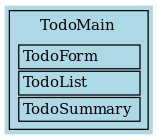
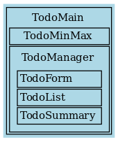

# Composing Features

_Note: this is Part 4 of "Composing Features and Behaviours in the Elm Architecture". See the
[Introduction](https://github.com/foxdonut/adventures-reactive-web-dev/tree/master/client-elm#composing-features-and-behaviours-in-the-elm-architecture)
for an overview and the table of contents._

In Part 3, we combined three features together. We connected them to each other with signals and
addresses, and we used `map3` to combine their views into the main view.

As we add more features, our `TodoMain` module can grow larger than we'd like, and it might become
somewhat unwieldy to wire everything and combine all the views together.

Let's say we decide that the combination of `TodoList`, `TodoForm`, and `TodoSummary` forms a group
that we'd like to compose into a feature. Let's call this feature `TodoManager`. By doing this, the
smaller features can still be used individually, but we can also use the composition of the three
features simply by using `TodoManager` without needing to know about the internal wiring details.

What we'd like to do next is to compose `TodoManager` with an additional feature, `TodoMinMax`,
which displays the highest and lowest priority of the todo list.

> _The `TodoMinMax` feature is trivial. The feature itself is not what's important here. What we are
> exploring is how to compose smaller features into one, and then use that feature with another
> feature._

To illustrate, what we have up to now is `TodoMain` with the three features:



We'll move the three features to `TodoManager`, create `TodoMinMax`, and change `TodoMain` so that
`TodoMinMax` is on top of `TodoManager`:



[TodoManager/Feature.elm](TodoManager/Feature.elm)
```elm
type alias Config =
  { outputs :
      { onUpdatedList : List (Signal.Address (List Todo))
      , onSaveTodo : List (Signal.Address (Maybe Todo))
      }
  }


type alias TodoManagerFeature =
  { html : Signal Html
  , tasks : Signal (Task Never ())
  }
```

[TodoManager/Feature.elm](TodoManager/Feature.elm)
```elm
makeTodoListFeature : Config -> TodoListFeature
makeTodoListFeature config =
  createTodoListFeature
    { inputs = [ todoListMailbox.signal ]
    , outputs =
        { onEditTodo = [ Signal.forwardTo todoFormMailbox.address Edit ]
        , onUpdatedList = Signal.forwardTo todoSummaryMailbox.address Update :: config.outputs.onUpdatedList
        }
    }


makeTodoFormFeature : Config -> TodoFormFeature
makeTodoFormFeature config =
  createTodoFormFeature
    { inputs = [ todoFormMailbox.signal ]
    , outputs =
        { onSaveTodo =
            List.append
              [ Signal.forwardTo todoListMailbox.address UpdateList
              , Signal.forwardTo todoSummaryMailbox.address LastSaved
              ]
              config.outputs.onSaveTodo
        }
    }
```

[TodoManager/Feature.elm](TodoManager/Feature.elm)
```elm
makeHtml : TodoListFeature -> TodoFormFeature -> TodoSummaryFeature -> Signal Html
makeHtml todoListFeature todoFormFeature todoSummaryFeature =
  Signal.map3 view todoListFeature.html todoFormFeature.html todoSummaryFeature.html


makeTasks : TodoListFeature -> TodoFormFeature -> TodoSummaryFeature -> Signal (Task Never ())
makeTasks todoListFeature todoFormFeature todoSummaryFeature =
  Signal.mergeMany
    [ todoListFeature.tasks
    , todoFormFeature.tasks
    , todoSummaryFeature.tasks
    ]
```

[TodoManager/Feature.elm](TodoManager/Feature.elm)
```elm
createTodoManagerFeature : Config -> TodoManagerFeature
createTodoManagerFeature config =
  let
    todoListFeature =
      makeTodoListFeature config

    todoFormFeature =
      makeTodoFormFeature config

    todoSummaryFeature =
      makeTodoSummaryFeature config

    html =
      makeHtml todoListFeature todoFormFeature todoSummaryFeature

    tasks =
      makeTasks todoListFeature todoFormFeature todoSummaryFeature
  in
    { html = html
    , tasks = tasks
    }
```

[TodoMain.elm](TodoMain.elm)
```elm
todoMinMaxMailbox : Signal.Mailbox TodoMinMax.Action.Action
todoMinMaxMailbox =
  Signal.mailbox (Update [])


todoMinMaxFeature : TodoMinMaxFeature
todoMinMaxFeature =
  createTodoMinMaxFeature { inputs = [ todoMinMaxMailbox.signal ] }


todoManagerFeature : TodoManagerFeature
todoManagerFeature =
  createTodoManagerFeature
    { outputs =
        { onUpdatedList = [ Signal.forwardTo todoMinMaxMailbox.address Update ]
        , onSaveTodo = []
        }
    }
```

[TodoMain.elm](TodoMain.elm)
```elm
todoMainView : Html -> Html -> Html
todoMainView todoManagerView todoMinMaxView =
  div
    []
    [ todoMinMaxView
    , todoManagerView
    ]


html : Signal Html
html =
  Signal.map2 todoMainView todoManagerFeature.html todoMinMaxFeature.html


tasks : Signal (Task Never ())
tasks =
  todoManagerFeature.tasks


todoMainFeature =
  { html = html
  , tasks = tasks
  }
```

