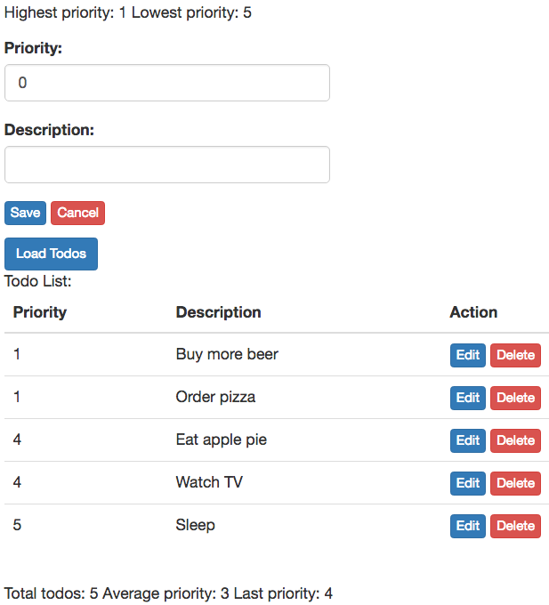

# Composing Features and Behaviours in the Elm Architecture

by Fred Daoud - foxdonut, [@foxdonut00](https://twitter.com/foxdonut00)

## What is this article about?

First, some disclaimers: I only recently started learning Elm, and do not claim to be an expert.
Furthermore, I do not claim to have invented any of the ideas presented in this article. The purpose
is simply to put together what I feel are the best parts of what I have learned from
[The Elm Architecture](https://github.com/evancz/elm-architecture-tutorial/),
[Cycle.js](http://cycle.js.org/model-view-intent.html),
[RxJS](https://github.com/Reactive-Extensions/RxJS),
[Redux](http://redux.js.org/docs/introduction/ThreePrinciples.html), and others.

That being said, my goal is to explain an approach to organize Elm code into _features_, where each
feature is part of a page and is decoupled from other features, and to connect these features with
_behaviours_. Behaviours are "what happens next" during an Event -> Signal -> Update -> View
reaction. Specifically, we want to be able to

- Create features: each feature should be self-contained and independent of other features.
- Chain events: _after this happens, that should happen next_.
- Connect features with signals: _after this happens, notify all other features that want to be notified_,
without needing to "know" what those other features are. Features react to events: _do something
when **this** happens_, without needing to "know" which feature made **this** happen.

This will hopefully become clear when we dig into it and look at the code. What's important to know
before reading on is that I assume knowledge of The Elm Architecture, because I build on top of that
and will not go over the Elm Architecture itself. Please refer to
[The Elm Architecture](https://github.com/evancz/elm-architecture-tutorial/)
and [The Elm Tutorial](http://www.elm-tutorial.org/).

## Example Overview

I will use a simple Todo list application as an example. The application is on a single page, with a
list of todos and a form, allowing for creating, editing, and deleting todos.

The application is backed by a server that accepts requests, using JSON as the data exchange format.
The server is implemented with [Koa](http://koajs.com/). I won't go into the details of the server
implementation since it is not the focus of this article.

## Creating Features

The Todo example application has two features: `TodoList` and `TodoForm`. I call them _Features_ in
this article, but feel free to substitute another term if you prefer. I went with _feature_ because
I find that some terms such _component_ and _module_ are already used everywhere, and mean different
things to different people.

When I say _creating a feature_, in practical terms I mean to:

- create a directory for the feature, e.g. `TodoList`
- put the files relevant to the feature inside that directory:
  - `Action.elm` - defines the `Action` type used by the feature
  - `Feature.elm` - creates the feature by wiring everything together
  - `Model.elm` - defines the types used for the feature's model
  - `Service.elm` - creates the services (e.g. HTTP tasks) that the feature needs
  - `Update.elm` - defines the `update` function
  - `View.elm` - contains the code that renders the feature's view.
- create the feature as a mini "App" using `StartApp.start`.

With each feature being an independent mini "App", we can compose and combine them to create
higher-level mini "Apps", ultimately creating the root App inside the top-level `Main` function.

Each feature is independent of other features. We can still provide communication between features.
We will explore that in the later sections of this article. First, let's look at the `TodoList`
feature.

### The `TodoList` Feature

## Chaining Events

## Connecting Features with Signals

